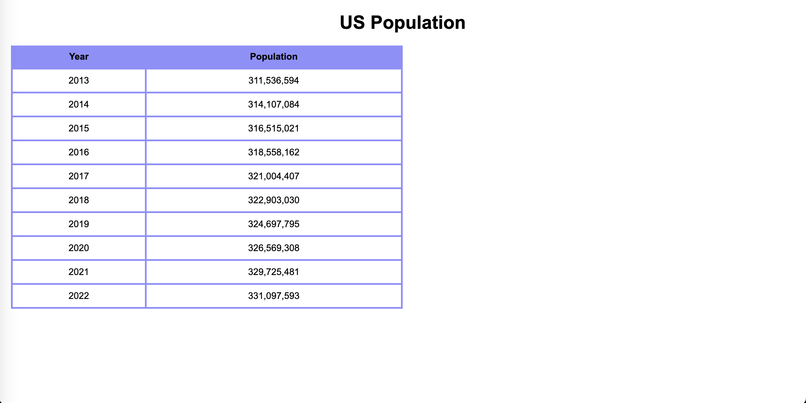

# Python-Web-Development-Assignment-2

### This is the second assignment for my Python Web Development class.

In this assignment, we were instructed to create an HTML page to display US Population data from Data USA. 

The HTML page is called index.html. Upon page load, the US Population data is retrieved from an API endpoint (https://datausa.io/api/data?drilldowns=Nation&measures=Population). Then the data is parsed, sorted, and properly displayed in a table. The following image shows the resulting web application:

